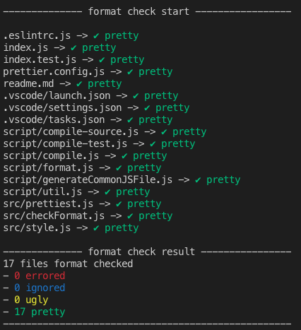

# Prettiest

Run this during continuous integration to ensure your files respects your prettier configuration.

## Example

This is a screenshot of the terminal output after running [./script/check-format.js](./script/check-format.js) with node.

